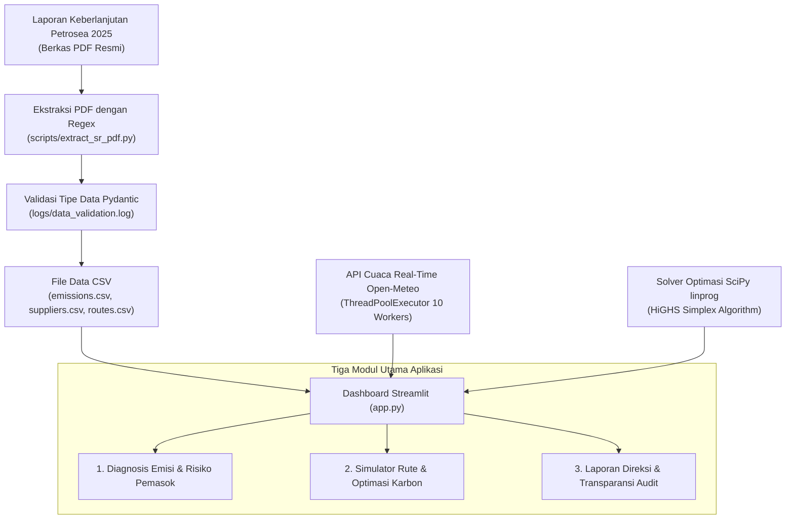

# Petrosea EcoLogix — Dashboard Dekarbonisasi Logistik & Supply Chain Intermodal

[](https://streamlit.io/)
[](https://python.org)
[](https://scipy.org)
[](https://pydantic.dev/)
[](https://plotly.com/)

---

## Ringkasan Proyek

**Petrosea EcoLogix** adalah platform dashboard interaktif tingkat eksekutif yang mensimulasikan optimasi logistik dan dekarbonisasi rantai pasok berbasis data publik Laporan Keberlanjutan PT Petrosea Tbk 2025. Platform ini mensimulasikan tren emisi (Scope 1–3), menganalisis trade-off moda transportasi (darat vs laut vs udara), serta mengoptimalkan efisiensi biaya dari berbagai skenario kebijakan dekarbonisasi menggunakan solver matematika SciPy Linear Programming (`linprog`).

Data utama diekstrak dari Laporan Keberlanjutan PT Petrosea Tbk 2025 menggunakan skrip Python (`PyMuPDF` + `regex`) dan divalidasi ketat lewat skema Pydantic (`modules/schemas.py`). 

Aplikasi diolah dalam tiga modul utama:
1. **Diagnosis Emisi & Risiko Pemasok**: Visualisasi tren emisi historis, intensitas karbon pendapatan, serta evaluasi kepatuhan ESG/TKDN/ISO 14001 vendor utama.
2. **Optimasi Rute Intermodal & Simulasi Kebijakan Karbon**: Prediksi cuaca real-time Open-Meteo API (parallelized via `ThreadPoolExecutor`), evaluasi 3 moda pengiriman, proteksi kargo presisi *Sealed Desiccant Container*, serta solver optimasi linier SciPy.
3. **Laporan Direksi & Transparansi Data Audit**: Memorandum eksekutif terpadu (*Single Unified Executive Briefing Memo*) dengan status kebijakan dinamis (`● TARGET TERKUNCI` / `○ BASELINE STANDAR`) dan berkas audit CSV/Log.

---

## Alur Kerja Data & Arsitektur Sistem



---

## Fitur Utama & Inovasi Teknikal

### 1. Sustainable Corporate Design System & Adaptive Theme
- Tema visual eksklusif berstandar *Executive Enterprise*: Warna **Teal/Dark Green (`#005A36`)**, **Oranye Petrosea (`#E87722`)**, dan **Soft Cream (`#FDFBF7`)**.
- Menggunakan variabel CSS bawaan Streamlit (`var(--background-color)`, `var(--secondary-background-color)`, `var(--text-color)`) sehingga **100% adaptif dan aman saat berpindah antara Light Mode & Dark Mode**.

### 2. High-Performance Concurrency API Engine
- Mengintegrasikan `concurrent.futures.ThreadPoolExecutor` (10 workers) untuk mengambil data cuaca dan indeks kualitas udara (US AQI) secara paralel dari Open-Meteo API di 5 koridor pengiriman.
- Memangkas waktu muat aplikasi dari **~15 detik menjadi ~1.5 detik** dengan proteksi tembolok `@st.cache_data(ttl=3600)`.

### 3. Prescriptive Decarbonization Solver (SciPy `linprog`)
- Menggunakan algoritma optimasi linier SciPy (`linprog` - HiGHS Solver) untuk menghitung alokasi 4 tuas dekarbonisasi:
  - Substitusi Biofuel (B35–B100)
  - Peningkatan Belanja Pemasok Lokal
  - Pengalihan Moda Transportasi ke Marine Barge (Laut)
  - Elektrifikasi / Retrofit EV Fleet Alat Berat
- Dilengkapi tombol preset terkalibrasi: **`🎯 Target 5%`**, **`🚀 Target 15%`**, dan **`🏆 Target 30% (Net-Zero)`**.

### 4. Single Unified Executive Briefing Memo (Tab 3)
- Menyatukan diagnosis emisi, evaluasi risiko vendor, rekomendasi logistik koridor, dan proyeksi dekarbonisasi ke dalam **1 Dokumen Memorandum Eksekutif Terpadu**.
- Dilengkapi stempel status kebijakan dinamis dan *progress bar visual* realisasi pengadaan lokal menuju target 40.0%.

### 5. Registri Asumsi Model (Assumption Registry)
- Memetakan 20+ koefisien emisi dan biaya marginal dekarbonisasi (MAC) lengkap dengan tingkat keyakinan (*High/Medium/Low*) dan rujukan referensi resmi (GRI 305, IPCC 2006/2019, ESDM, GLEC V2.0).

---

## Tampilan Modul Dashboard

### Tab 1: Profil Emisi & Risiko Pemasok
- **Visualisasi Emisi Historis**: Grafik area & batang interaktif Plotly untuk Scope 1, Scope 2, dan Scope 3 bersandingan dengan rasio intensitas karbon per $1M pendapatan.
- **Evaluasi Pemasok Korporat**: Matriks *Scatter Plot* (ESG Score vs Spend) & *Radar Chart* kepatuhan ISO 14001 serta standar TKDN.

### Tab 2: Simulator Rute & Optimasi Karbon
- **Prediksi Cuaca Real-Time & Early Warning K3**: Peta interaktif Folium + Open-Meteo API untuk mendeteksi cuaca buruk di koridor laut.
- **Evaluasi 3 Moda Transportasi**: Trade-off Waktu Transit vs Emisi Scope 3 antara Marine Barge, Trucking, dan Air Freight, dilengkapi penghitungan otomatis *Sealed Desiccant Container System*.
- **Optimasi Biaya & Kebijakan Karbon**: Slider interaktif & SciPy solver untuk proyeksi penghematan biaya ($ USD) dan ekuivalensi dampak lingkungan (Pohon, Truk Retired, Rumah Listrik Bersih).

### Tab 3: Laporan Direksi & Transparansi Audit
- **Memorandum Hasil Audit & Keputusan Strategis Direksi**: Format memo eksekutif terstruktur untuk rapat Board of Directors.
- **Transparansi Data Audit & Export**: Berkas audit mentah CSV (Emisi Historis & Pemasok) serta log validasi Pydantic (`logs/data_validation.log`).

---

## Stack Teknologi

- **Language & Framework**: Python 3.10+, Streamlit 1.42.0
- **Optimization Engine**: SciPy (`scipy.optimize.linprog`)
- **Concurrency & Parallelism**: `concurrent.futures.ThreadPoolExecutor`
- **Data Engineering & Validation**: Pandas, Pydantic v2
- **PDF Extraction**: PyMuPDF (`fitz`), Regex Parser
- **Visuals & Maps**: Plotly Express & Graph Objects, Folium, Open-Meteo API

---

## Cara Menjalankan di Lokal

### 1. Clone Repositori
```bash
git clone https://github.com/sulthanbadarudinalkatiri/petrosea-ecologix.git
cd petrosea-ecologix
```

### 2. Aktivasi Environment & Install Pustaka
```bash
python -m venv venv
venv\Scripts\activate   # Windows OS
# source venv/bin/activate # Linux / macOS

pip install -r requirements.txt
```

### 3. Jalankan Aplikasi
```bash
streamlit run app.py
```

---

## Pengembang

**Sulthan Badarudin Al-Katiri**  
*Proyek Portofolio: Petrosea EcoLogix — ESG & Supply Chain Decarbonization Platform*
