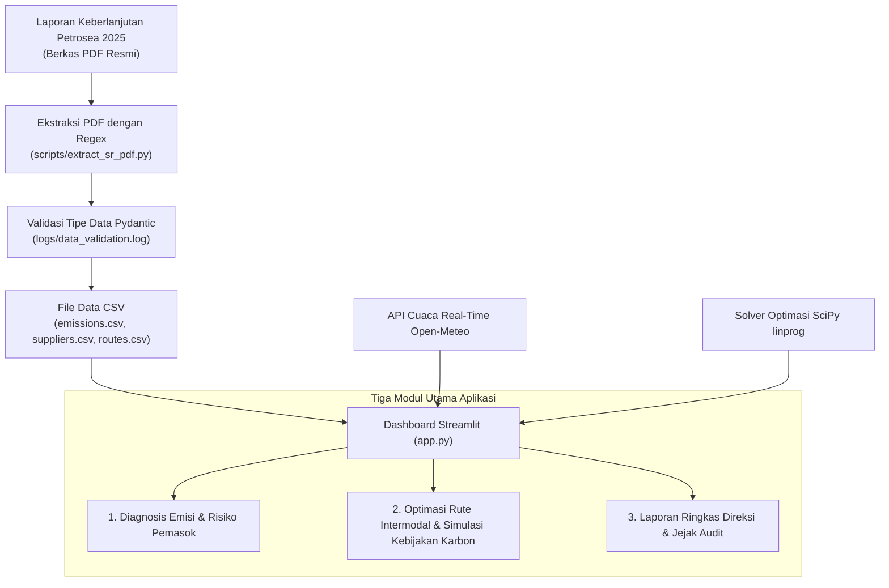

# Petrosea EcoLogix — Dashboard Dekarbonisasi Logistik & Supply Chain Intermodal

[](https://streamlit.io/)
[](https://python.org)
[](https://scipy.org)
[](https://pydantic.dev/)
[](https://plotly.com/)

---

## Ringkasan Proyek

**Petrosea EcoLogix** adalah proyek portofolio aplikasi dashboard interaktif yang mensimulasikan optimasi logistik dan dekarbonisasi rantai pasok berbasis data publik Laporan Keberlanjutan PT Petrosea Tbk 2025. Aplikasi ini dirancang untuk memvisualisasikan tren emisi (Scope 1–3), menganalisis trade-off moda transportasi (darat vs laut vs udara), serta mensimulasikan efisiensi biaya dari berbagai skenario kebijakan dekarbonisasi.

Data utama diekstrak dari Laporan Keberlanjutan PT Petrosea Tbk 2025 menggunakan skrip Python (`PyMuPDF` + `regex`) dan divalidasi ketat lewat Pydantic. Data diolah dalam tiga modul inti:
1. **Diagnosis Emisi & Risiko Pemasok**: Analisis tren emisi historis, intensitas karbon pendapatan, serta pemetaan ESG/TKDN vendor utama.
2. **Optimasi Rute Intermodal & Simulasi Kebijakan Karbon**: Prediksi cuaca real-time Open-Meteo API, evaluasi 3 moda pengiriman, proteksi material presisi, serta solver optimasi linier SciPy (`linprog`).
3. **Laporan Ringkas Direksi & Jejak Audit**: Briefing eksekutif terintegrasi dengan Dual-Scenario Commitment Lock (Logistik Koridor & Dekarbonisasi Tambang) dan berkas audit CSV.

---

## Alur Kerja Data



---

## Detail Solusi Teknikal

1. **Ekstraksi PDF Otomatis (`scripts/extract_sr_pdf.py`)**:
   - Membaca teks mentah dari PDF Laporan Keberlanjutan Petrosea 2025 tanpa input manual. Menggunakan pola *regex* untuk menarik angka emisi Scope 1–3, pendapatan, dan persentase TKDN.
2. **Dual-Commitment Lock Architecture (`modules/tab2_optimizer.py` & `modules/tab3_executive.py`)**:
   - Fitur **Kunci Rekomendasi Logistik Koridor** mengunci pilihan rute, moda pengiriman, transit days, dan biaya desiccant ke `st.session_state['locked_logistics']`.
   - Fitur **Kunci Skenario Dekarbonisasi Tambang** mengunci alokasi B100, local sourcing, EV retrofit, dan estimasi hemat biaya ke `st.session_state['locked_decarb']`.
   - Modul Tab 3 membaca kedua skenario secara independen maupun bersamaan.
3. **Optimasi Kebijakan Dekarbonisasi (`modules/tab2_optimizer.py`)**:
   - Menggunakan `scipy.optimize.linprog` (algoritma HiGHS Simplex) untuk mencari kombinasi 4 kebijakan (Biofuel B100, Local Sourcing, Marine Barge, EV Retrofit) yang memenuhi target reduksi Net-Zero 30% dengan biaya terendah.
4. **Validasi Data Pydantic (`modules/data_loader.py`)**:
   - Memastikan setiap baris data yang dibaca dari CSV memenuhi skema tipe data. Jika ada data tidak valid, baris tersebut dicatat ke `logs/data_validation.log`.

---

## Tampilan Fitur Dashboard

### 1. Diagnosis Emisi & Risiko Pemasok
- **Grafik Tren Emisi**: Menampilkan tren Scope 1, Scope 2, dan Scope 3 dari tahun ke tahun bersandingan dengan intensitas emisi per pendapatan.
- **Evaluasi Pemasok**: Matriks scatter plot dan radar chart untuk memetakan risiko ESG, TKDN, dan *lead time* pemasok.

---

### 2. Optimasi Rute Intermodal & Simulasi Kebijakan Karbon
- **Evaluasi Moda Pengiriman & Proteksi Material EPC**: Perbandingan 3 moda (Marine Barge, Trucking, Air Freight) dilengkapi pemilih rute koridor eksplisit dan kalkulasi otomatis container desiccant.
- **Optimasi Biaya & Kebijakan Karbon**: Slider interaktif dan solver otomatis SciPy untuk mencari alokasi kebijakan paling efisien.
- **Peta Rute Logistik**: Peta interaktif Folium yang memetakan koridor pengiriman darat dan laut beserta data cuaca real-time dari Open-Meteo.

---

### 3. Laporan Ringkas Direksi & Jejak Audit
- **Laporan Ringkas Direksi**: Format narasi eksekutif terstruktur (Diagnosis Emisi, Risiko Pemasok, Rekomendasi Logistik Koridor, Proyeksi Dekarbonisasi Tambang).
- **Jurnal Audit Risiko Operasional**: Log kejadian risiko operasional dan cuaca 7 hari terakhir yang diperbarui otomatis mengikuti tanggal berjalan (`DD-MM-YYYY HH:MM`).

---

## Stack Teknologi

- **Bahasa & Web Framework**: Python 3.10+, Streamlit 1.42.0
- **Optimasi & Matematika**: SciPy (`scipy.optimize.linprog`)
- **Olah Data & Validasi**: Pandas, Pydantic v2
- **ETL PDF**: PyMuPDF (`fitz`), Regex
- **Visualisasi & Peta**: Plotly Express/Graph Objects, Folium, Open-Meteo API

---

## Cara Menjalankan di Lokal

### 1. Clone Repositori
```bash
git clone https://github.com/sulthanbadarudinalkatiri/petrosea-ecologix.git
cd petrosea-ecologix
```

### 2. Buat Environment & Install Library
```bash
python -m venv venv
venv\Scripts\activate   # Windows
# source venv/bin/activate # Linux/macOS

pip install -r requirements.txt
```

### 3. Jalankan Aplikasi
```bash
streamlit run app.py
```

---

## Pengembang

**Sulthan Badarudin Al-Katiri**  
*Proyek Portofolio: Petrosea EcoLogix*
